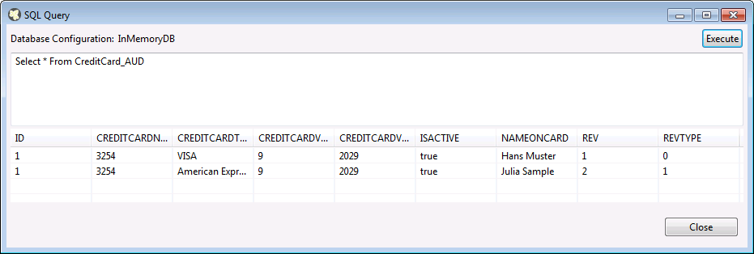

# Axon.ivy Sample Project using Hibernate Envers

Note: This project requires Axon.ivy Designer 6.7 or later.

## General
This ivy project makes use of [Hibernate Envers](http://hibernate.org/orm/envers/), which allows a developer to annotate his Entities with @Audited,
so that changes on them can be tracked.

